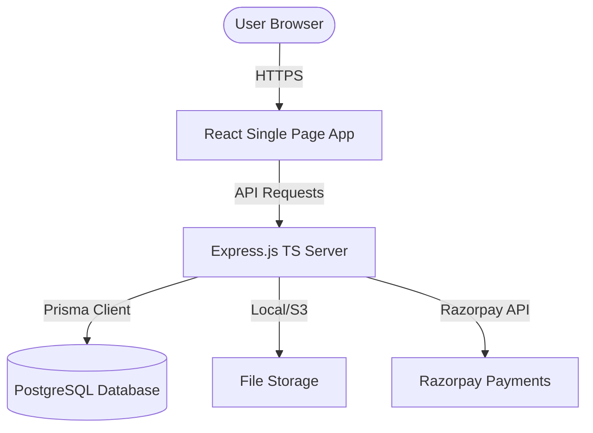

# Implementation Plan - Premium Coaching Management System

This document outlines the detailed architectural design, database schema, API design, folder structure, and verification plan for the Coaching Management System.

## Architecture Overview

We will build a monorepo containing a TypeScript Express backend and a React + Vite + TypeScript + Tailwind CSS frontend.



---

## User Review Required

> [!IMPORTANT]
> The database schema uses **UUIDs** for all primary keys to ensure scalability.
> For development/testing, AWS S3 file storage and Razorpay payment credentials can be set, but if they are missing, the backend will automatically fall back to **Local File Storage** (serving files from `uploads/`) and **Mock Payment Validation** respectively. This allows running and testing the system out-of-the-box.

---

## Open Questions

> [!NOTE]
> None at the moment. All instructions in the request are fully specified and logical. I will assume a fallback logic for payment/storage configuration to keep the application ready for local testing out of the box.

---

## Proposed Changes

### Component 1: Database Schema & Prisma

We will define models for user management, role-based access, academic entities (courses, batches, attendance), online exams (MCQ series), support tickets, billing (payments, fees), and audit logs.

#### [NEW] [schema.prisma](file:///c:/Users/sagar/Downloads/sagar/noble_classes/backend/prisma/schema.prisma)
The schema will contain the following models:
- **Enums**: `Role` (ADMIN, TEACHER, STUDENT), `AdmissionStatus` (PENDING, APPROVED, REJECTED), `PaymentStatus` (PENDING, PAID, PARTIAL, FAILED), `PaymentMode` (ONLINE, OFFLINE), `FeeType` (ADMISSION, TUITION, EXAM, OTHER), `AttendanceStatus` (PRESENT, ABSENT, LATE), `TicketPriority` (LOW, MEDIUM, HIGH), `TicketStatus` (OPEN, IN_PROGRESS, CLOSED), `AudienceType` (ALL, STUDENTS, TEACHERS)
- **User**: Authentication, roles, email verification, password reset, and refresh token tracking.
- **StudentProfile**: Connected to User. Contains biodata, parent contact, uploaded documents (Aadhaar, marksheet, passport photo), batch connection, admission status, payment status.
- **TeacherProfile**: Connected to User. Contains qualifications, experience, biography, specialization.
- **Course**: Title, description, duration, fees, active status.
- **Batch**: Name, time schedule, relation to course, list of students.
- **Attendance**: Date-based attendance record per student.
- **FeePayment**: Transaction records, receipts, invoice link, Razorpay order/payment tracking, and installment status.
- **Exam**: MCQ test container (time limit, negative marking, batch relation).
- **Question**: Specific questions with options and correct answers.
- **ExamResult**: Detailed student score card, leaderboard data.
- **StudyMaterial**: Downloadable PDFs, categorized by course.
- **Announcement**: Notices and news for students/teachers.
- **BlogPost**: Blog CMS for SEO optimization.
- **GalleryItem**: Management of photo gallery by album.
- **Testimonial**: User reviews for homepage.
- **ContactEnquiry**: Lead submissions.
- **SupportTicket** & **SupportReply**: Helpdesk system for students.
- **AuditLog**: Administrative activity tracker.

---

### Component 2: Backend REST API (Node.js + Express.js + TS)

We will implement a structured, modular Express API with validation using `joi` or `zod`, secure hashing using `bcryptjs`, and authentication using `jsonwebtoken` (access + refresh tokens).

#### Directory Structure:
```
backend/
├── prisma/
│   ├── schema.prisma
│   └── seed.ts
├── src/
│   ├── config/          # db, s3, razorpay, passport
│   ├── controllers/     # Controller logic per module
│   ├── middlewares/     # Error handling, Auth, Role validation, Upload limits, Rate limiting
│   ├── routes/          # Express route declarations
│   ├── services/        # S3 storage, PDF rendering, Excel parsing, Razorpay billing, Email/SMS notifier
│   ├── utils/           # Custom AppError, Logger, API response helper
│   ├── app.ts           # Express App setup
│   └── server.ts        # Server entry point
├── package.json
├── tsconfig.json
├── Dockerfile
└── .env.example
```

---

### Component 3: Frontend (React 19 + Vite + Tailwind + TS)

We will design a highly professional SaaS dashboard UI utilizing Framer Motion for animations, custom tailwind configurations, glassmorphism designs, dark/light theme, and dynamic statistics charts.

#### Directory Structure:
```
frontend/
├── public/
├── src/
│   ├── assets/          # SVG illustration, logo assets
│   ├── components/      # UI components (buttons, inputs, cards) & layouts
│   ├── context/         # AuthContext and ThemeContext
│   ├── hooks/           # useQuery / useMutation custom hooks
│   ├── pages/           # Pages (Public, Admin, Teacher, Student Dashboards)
│   ├── services/        # Axios API client functions
│   ├── utils/           # Excel templates, custom formatting helpers
│   ├── App.tsx          # Router setup and global providers
│   ├── index.css        # Tailwind directives and custom themes
│   └── main.tsx         # React root renderer
├── package.json
├── tsconfig.json
├── tailwind.config.js
├── postcss.config.js
├── components.json
├── Dockerfile
└── .env.example
```

---

## Verification Plan

### Automated Tests
- Test user registration, login, token refresh, and role access verification (using curl or backend script tests).
- Validate Excel attendance processor utility with correct and malformed columns.
- Test MCQ auto-evaluation correctness (negative marking calculation).

### Manual Verification
- Render the frontend and navigate public pages.
- Log in as **Admin** and create a course, a batch, and a teacher.
- Log in as **Student** and fill in an online admission, process mock payment.
- Log in as **Teacher**, download the attendance template, fill mock attendance, upload it, and verify attendance records update.
- Complete an online MCQ test and verify leaderboard and scores.
